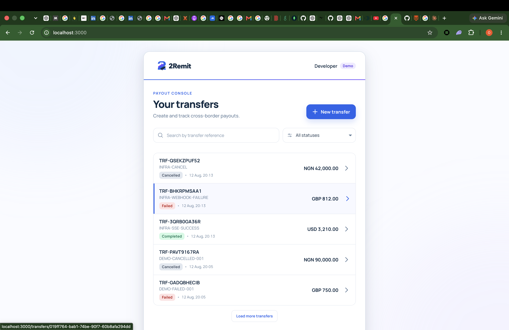
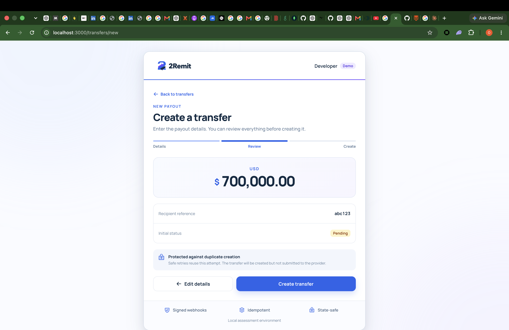
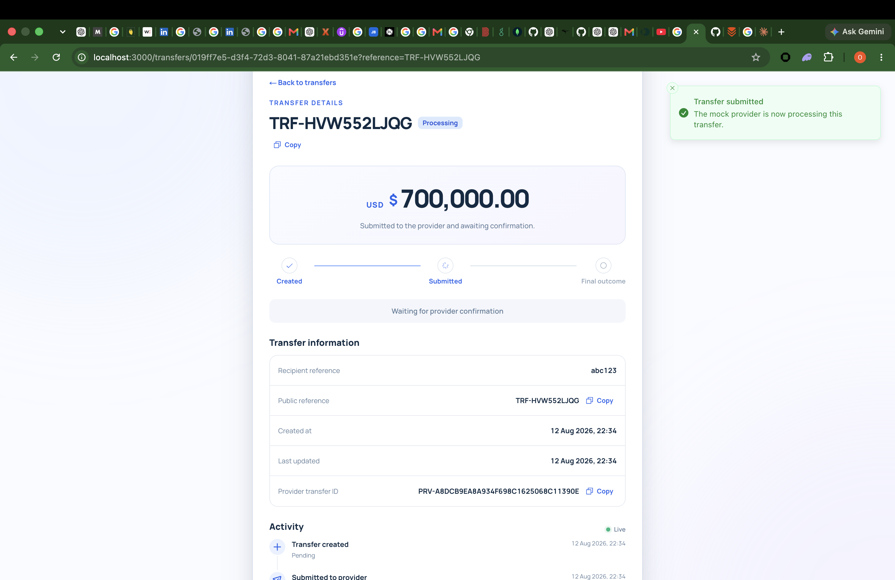
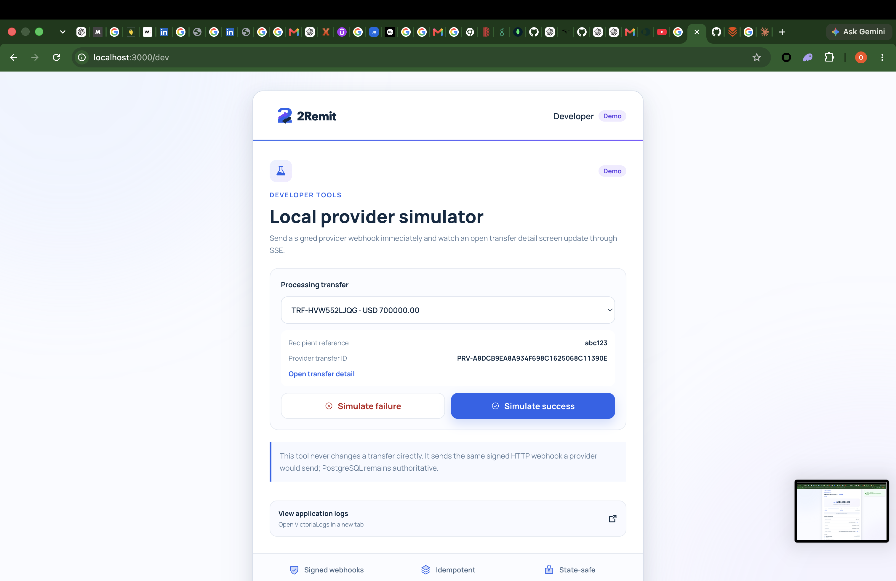
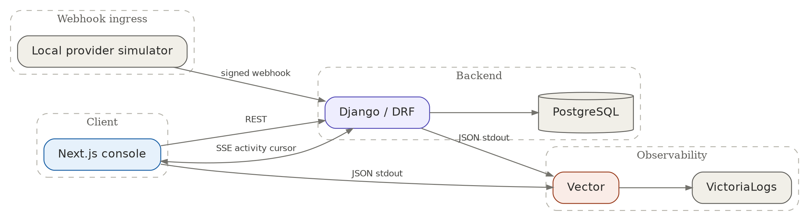

<p align="center">
  
</p>

<h1 align="center">2Remit</h1>

<p align="center">
  A correctness-first cross-border payout console built with Django, DRF, Next.js and PostgreSQL.
</p>

<p align="center">
  <a href="docs/ENGINEERING.md"><strong>Read the engineering deep dive →</strong></a>
</p>



## Why 2Remit

2Remit follows a transfer from creation to a terminal provider outcome without hiding the hard parts of payment engineering:

- Explicit, transaction-safe transfer state machine
- Idempotent creation with durable request fingerprints
- HMAC-signed provider webhooks and delivery idempotency
- Durable PostgreSQL activity history with live SSE updates
- Server-side cursor pagination, reference search and status filtering
- Development-only provider simulator
- Docker Compose, GitHub Actions CI and structured JSON logs via Vector and VictoriaLogs

> Tests are mandatory for this project and form part of its acceptance criteria.

## Product walkthrough

| Review a payout | Track provider processing |
| --- | --- |
|  |  |

### Simulate a real provider callback



The simulator sends an immediate signed HTTP webhook through the real handler. It does not mutate a transfer directly.

## Quick start

```bash
git clone https://github.com/babafemi99/2remmit.git
cd 2remmit
cp .env.example .env
make compose-up
```

Review the local-only values in `.env` before starting. `make compose-up` passes that file explicitly to Docker Compose, builds the images, runs both test suites as startup gates, applies migrations, seeds demo data, and starts the healthy stack. If either test gate fails, the applications do not start.

Make targets fall back to the safe local defaults in `.env.example` when `.env` is absent, so lifecycle commands such as `make compose-down` remain usable before setup.

If Docker already has 2Remit volumes initialized with different PostgreSQL credentials, reset only this project's local data and start again:

```bash
make compose-reset
make compose-up
```

`compose-reset` deletes the local 2Remit PostgreSQL and log volumes. Normal `compose-down` preserves them.

| Service | URL |
| --- | --- |
| 2Remit frontend | http://localhost:3000/transfers |
| Django API | http://localhost:8000/api/transfers/ |
| Provider simulator | http://localhost:3000/dev |
| VictoriaLogs UI | http://localhost:9428/select/vmui/ |

If port 3000 is occupied:

```bash
FRONTEND_PORT=3100 make compose-up
```

Startup waits for PostgreSQL, applies migrations, and seeds five stable demo transfers. Seeding is safe to repeat:

```bash
make seed
```

## Five-minute demo

1. Open `/transfers`, then create a transfer: it starts **Pending**.
2. Cancel a pending transfer to demonstrate the immutable cancellation path.
3. Submit another transfer: it becomes **Processing** and receives a provider ID.
4. Keep its detail page open, then use `/dev` to send Success or Failure.
5. The signed webhook records durable activity; SSE updates the open detail view immediately.

## Run the checks

```bash
make test
```

This runs the PostgreSQL-backed Django suite plus frontend formatting, ESLint, strict TypeScript, Vitest and the production Next.js build. See the [full verification matrix](docs/ENGINEERING.md#tests-and-correctness-evidence).

## Architecture



**Stack:** Python 3.14, Django 5.2, Django REST Framework, PostgreSQL 17, Next.js 16, React 19, TypeScript, Docker Compose, Vector and VictoriaLogs.

## Assumptions

- This is an open local assessment API, not a production multi-tenant service.
- PostgreSQL is required for row locks, concurrency behavior and durable state.
- NGN, GBP and USD are the supported currencies.
- Creating a transfer leaves it Pending; submission and provider simulation are explicit actions.
- The provider is fake, and one ASGI worker is acceptable for the demo's process-local SSE wake-up.

The complete assumptions and security implications are in the [engineering deep dive](docs/ENGINEERING.md#assumptions).

## Decision log

- **Contradictory terminal events.** The first terminal result wins. Later contradictions are retained for investigation but cannot rewrite settled transfer state.
- **Unknown provider IDs.** A correctly signed, well-formed unknown event is acknowledged and recorded. Retrying cannot create the missing provider mapping and risks a retry storm.
- **Signature verification.** HMAC verification occurs at the Django transport boundary over the exact raw body, before JSON validation or durable mutation.

Read the authoritative [decision log](docs/ENGINEERING.md#decision-log) for the reasoning, failure modes and [exact provider edge-case tests](docs/ENGINEERING.md#provider-edge-cases-ae).

## Deliberately left out

Authentication and tenant ownership, KYC/AML, wallets, FX pricing, fees, beneficiaries, a double-entry ledger and a real provider were excluded to keep the assessment focused on transfer correctness. Celery/Redis, an admin dashboard, tracing, Kubernetes and cloud deployment were also omitted because they add operational breadth without strengthening the required state, idempotency or webhook guarantees.

## Known limitations and risks

- The API and `/dev` simulator have no production authentication and must not be publicly exposed.
- SSE wake-ups are process-local and Compose intentionally runs one ASGI worker. Durable cursor replay prevents data loss, but instant multi-worker fan-out would require PostgreSQL `LISTEN/NOTIFY` or shared pub/sub.
- Unknown or contradictory provider events are retained but have no background reconciliation or alerting.
- No deployed environment, production load test or provider-sandbox contract test is claimed.

## What I would do with more time

I would add tenant authentication and object authorization first, followed by provider reconciliation and alerting, multi-worker SSE notification, rate limiting, request correlation with strict redaction, real-provider contract tests and load/failure testing around webhook bursts and long-lived streams.

## Intentional bug and process note

An early submit/cancel API path allowed `Transfer.DoesNotExist` to escape as a `500`. That could make clients retry a permanently missing resource. Commit [`6f9451c`](https://github.com/babafemi99/2remmit/commit/6f9451ce5edc33439bc6fb949417cf5b95c81350) added the missing-action regression tests and mapped the domain exception to `404 Not Found`. The lesson was to keep domain services transport-agnostic while explicitly translating every expected domain failure at the API boundary.

Git history is incremental across the domain model, API, regression fixes, webhook security, logging, simulator, activity/SSE, frontend and infrastructure. Risky behavior was accompanied by focused tests. The [full bug evidence and process history](docs/ENGINEERING.md#intentional-bug-note) names the exact tests and commit.
