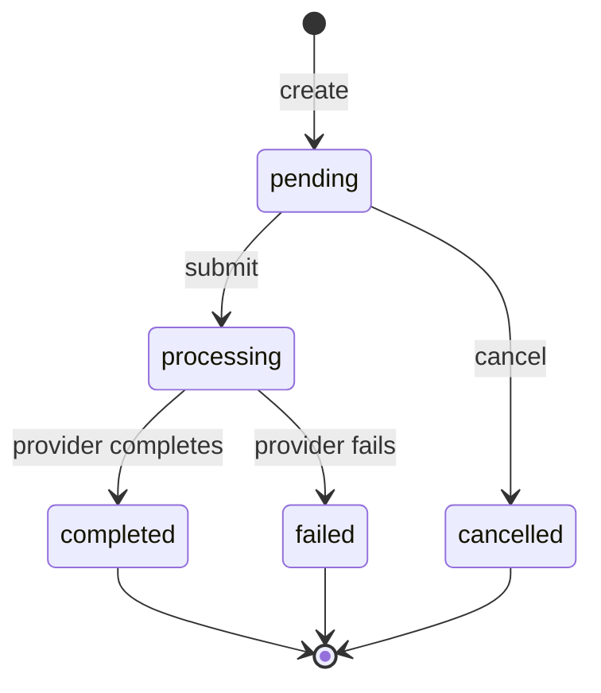

# 2Remit engineering deep dive

[← Back to the product README](../README.md)

This is the authoritative technical explanation for the 2Remit take-home. It describes the implemented system and evidence in this repository; it does not broaden the product scope.

> Tests are mandatory for this project and form part of its acceptance criteria.

The supplied assessment instructions prioritize correctness, explicit state transitions, idempotency, webhook security, deliberate edge-case behavior, and clear engineering judgment. The original assessment PDF was not present in the workspace during this documentation pass, so assessment wording below is mapped from the requirements supplied with the project rather than quoted from the PDF.

## Evaluation map

| Priority | Implementation | Evidence |
| --- | --- | --- |
| Transfer lifecycle | Locked domain services and immutable terminal states | `services.py`, `test_services.py` |
| Idempotency | Durable normalized fingerprint and replayed response | `idempotency.py`, `test_idempotency.py` |
| Webhook correctness | Raw-body HMAC, durable event claim, explicit outcomes | `webhook_security.py`, `webhooks.py` |
| Edge cases | Duplicate, contradictory, unknown and concurrent delivery tests | `test_webhook_processing.py` |
| Product usability | Create, detail, live history and simulator screens | `frontend/src/components/` |
| Operability | Compose, health checks, JSON logs, Vector, VictoriaLogs and CI | `compose.yaml`, `infra/vector/`, `.github/workflows/ci.yml` |

## Architecture


Domain transitions live in synchronous services, not views, idempotency code, webhooks or the simulator. PostgreSQL is authoritative for transfers, webhook claims and activities. The in-process notifier carries no business payload; it only wakes an SSE subscriber, which then queries committed rows.

Vector reads container output independently and ships it asynchronously. Neither application imports a VictoriaLogs client or waits for log storage, so VictoriaLogs failure cannot block payout traffic.

## Domain model and state machine



`submit_transfer`, `cancel_transfer`, `complete_transfer`, and `fail_transfer` run inside `transaction.atomic()` and lock the transfer using `select_for_update()`. A disallowed transition raises `InvalidTransition`; API actions translate that to `409 Conflict`. Terminal rows cannot transition again. The backend remains authoritative even when frontend controls are hidden.

`Transfer` uses a UUIDv7 primary key, a separate `TRF-…` public reference, exact `Decimal` money fields, NGN/GBP/USD currency choices, timestamps and an optional unique provider ID.

## API contract

| Method | Endpoint | Contract |
| --- | --- | --- |
| GET / POST | `/api/transfers/` | Cursor-paginated list; create requires `amount`, `currency`, `recipient_ref`, and `Idempotency-Key` |
| GET | `/api/transfers/{uuid}/` | Authoritative transfer detail; unknown UUID returns 404 |
| POST | `/api/transfers/{uuid}/submit/` | Pending → Processing; invalid state 409 |
| POST | `/api/transfers/{uuid}/cancel/` | Pending → Cancelled; invalid state 409 |
| GET | `/api/transfers/{uuid}/activities/` | Read-only cursor-paginated durable history |
| GET | `/api/transfers/{uuid}/activities/stream/` | SSE; `Last-Event-ID` takes precedence over `?after=` |
| POST | `/api/webhooks/provider/` | Signed provider event transport boundary |
| POST | `/api/dev/transfers/{uuid}/simulate-success/` | Development-only simulator action |
| POST | `/api/dev/transfers/{uuid}/simulate-failure/` | Development-only simulator action |

List responses use DRF's `{next, previous, results}` envelope. Transfer list query parameters are `cursor`, `query`, and `status`. The current page size is 5. Activity REST pages are newest first; the frontend merges them by durable ID into canonical ascending timeline order. SSE replay is ascending and uses numeric activity IDs, not the opaque REST cursor.

## Create idempotency

The create layer canonicalizes amount to two decimal places, uppercases currency, trims the recipient reference, serializes sorted compact JSON, and stores a SHA-256 request hash in `IdempotencyRecord`.

- Same key + same logical body returns the stored response and status.
- Same key + changed body returns 409.
- A unique database key, nested savepoint, `select_for_update()`, and outer transaction make the claim durable and serialize reuse of an existing key.
- The transfer, created activity and completed idempotency record commit atomically.
- The frontend generates one UUID per attempt, blocks double clicks, reuses it after uncertain network failure, and rotates it only after an attempted body changes.
- Logs record only `idempotency_key_present`; the key itself is never logged.

Evidence includes `test_same_key_and_payload_replays_original_result`, `test_same_key_with_changed_business_data_returns_conflict`, `test_existing_processing_record_returns_conflict_without_creating_transfer`, `prevents a double click from creating two requests`, `reuses the same key after an uncertain network failure`, and `rotates the key after an attempted body is edited`.

## Webhook verification

```text
HMAC-SHA256(PROVIDER_WEBHOOK_SECRET, raw_request_body)
X-Provider-Signature: sha256=<hex_digest>
```

The view reads `request.body` before serializer-driven processing and rejects an absent, malformed or incorrect signature before any durable mutation. `verify_webhook_signature` requires the exact lowercase 64-character hexadecimal shape and uses `hmac.compare_digest` for constant-time digest comparison. The secret comes from the environment and an empty secret fails closed.

Verification belongs at the HTTP transport boundary: it authenticates the exact bytes received, before JSON normalization or domain dispatch. Common mistakes are signing parsed/re-serialized JSON, comparing strings normally, accepting ambiguous header formats, mutating before verification, and placing secrets in frontend code.

A safe local demonstration is `/dev`; it signs deterministic compact JSON server-side and sends a real HTTP request to `/api/webhooks/provider/` without exposing the configured secret.

### Signature rejection evidence

- Missing: `test_missing_signature_returns_unauthorized`
- Malformed: `test_empty_and_malformed_signatures_return_false`
- Invalid digest: `test_invalid_signature_returns_unauthorized`
- Modified body: `test_modified_body_with_old_signature_returns_unauthorized`
- Wrong secret: `test_signature_generated_with_wrong_secret_returns_unauthorized`
- Valid: `test_valid_signature_processes_supported_event`
- Missing configured secret: `test_unconfigured_secret_fails_closed`

## Provider edge cases A–E

| Scenario | Chosen behavior | HTTP/status semantics | Why | Exact test |
| --- | --- | --- | --- | --- |
| A. Duplicate `event_id` | Exact durable duplicate is acknowledged once; changed data conflicts | Exact duplicate 200; reused ID with changed data 409 | Safe provider retries without accepting identity corruption | `test_exact_duplicate_does_not_apply_transition_twice`; `test_reused_event_id_with_changed_data_returns_conflict` |
| B. Completed followed by failed | First terminal outcome wins; second event is retained as `invalid_transition` | 200 acknowledgement; transfer remains Completed | Terminal immutability is safer than rewriting settled truth | `test_contradictory_terminal_events_are_recorded_without_mutation` |
| C. Pending/unmatched webhook | Unknown provider ID is recorded as `unknown_transfer`; a matched Pending transfer is `invalid_transition` | Both acknowledged 200 with no mutation | Retries will not repair an unknown lookup, and provider delivery should not bypass the FSM | `test_unknown_provider_id_is_recorded_as_deliberate_outcome`; `test_pending_transfer_events_are_recorded_as_invalid_transitions` |
| D. Different events with same Completed outcome | Record both provider events; apply only the first transition | Second is `invalid_transition`; transfer remains Completed | Event identity and business transition idempotency are different concerns | `test_second_completed_event_is_recorded_without_reapplying_transition` |
| E. Cancel after Processing | Reject cancellation | 409; remains Processing | Submission is the cancellation boundary | `test_cancel_processing_transfer_returns_conflict` |

## Durable activities

`TransferActivity` is append-only through the public API: no update/delete endpoints exist, and its foreign key protects a transfer with history from deletion. Lifecycle services insert activity inside the same transaction as the transfer mutation. If either write fails, both roll back. Provider activities link one-to-one to the durable `WebhookEvent`, preserving provenance without copying raw bodies, signatures, reasons, secrets, idempotency keys or recipient/money data.

Only after commit does `transaction.on_commit()` wake SSE subscribers and emit success logs. Rejected contradictory events remain operator-visible webhook records but do not become customer activity. Evidence: `test_activity_creation_rolls_back_with_transfer_transition`, `test_activity_insert_failure_rolls_back_transition`, `test_processed_webhook_links_one_provider_activity`, `test_contradictory_webhook_creates_no_customer_activity`, and `test_history_returns_not_found_and_is_read_only`.

## SSE correctness

The async generator subscribes before its first replay query, eliminating the commit-between-query-and-subscribe gap. Each subscriber captures its running loop and owns an `asyncio.Event`; synchronous `on_commit` code crosses the boundary with `loop.call_soon_threadsafe(event.set)`. A lock protects a registry keyed by transfer UUID, so multiple subscribers are supported without cross-transfer delivery.

After every wake-up, SSE queries PostgreSQL for activities greater than its durable ID cursor and emits them ascending. `Last-Event-ID` overrides `?after=`; batches are capped at 100. Fifteen-second comments keep idle connections alive. Cancellation is re-raised and `finally` unregisters the subscription; closed-loop entries are ignored and removed.

The frontend connects only after detail and history load, tracks the highest durable ID, deduplicates by ID, ignores another transfer's events and prevents terminal-state regression. It closes EventSource on unmount and uses bounded reconnect attempts; HTTP detail/history and manual refresh remain the fallback.

Evidence includes `test_headers_and_initial_replay`, `test_after_cursor_waits_then_receives_committed_activity`, `test_last_event_id_takes_precedence_over_after`, `test_heartbeat_and_cancelled_stream_cleanup`, `test_no_cross_transfer_delivery`, `resumes from the highest durable cursor and closes on unmount`, and `reconnects after the latest processed durable activity`.

The limitation is explicit: process-local notification requires one application worker. A future multi-worker version can replace only the wake-up implementation with PostgreSQL `LISTEN/NOTIFY` or shared pub/sub; the activity model, API cursor, replay contract and frontend need not change.

## Pagination, search and status filtering

Both list endpoints use DRF cursor pagination with a page size of 5. Transfers order by `-created_at, -id`, giving a deterministic UUID tie-breaker; activities order by `-id`. Reference search (`icontains`) and validated status filters are applied before pagination. The frontend persists `query` and `status` in the URL, resets results/cursor when either changes, debounces initial requests by 200 ms, and offers explicit load-more controls.

The request cleanup flag prevents an unmounted or superseded request from applying state, while cursor results append to the current page. Boundary/non-duplication coverage is in `test_list_uses_cursor_pagination`, `test_list_filters_before_paginating`, and `test_activity_history_uses_cursor_pagination_without_duplicates`; frontend behavior is covered by `searches by public transfer reference`, `filters transfers by status`, and `shows the filtered empty state`.

## Frontend state safety

Only Pending shows Submit and Cancel. Processing and terminal statuses render information instead of mutation controls. Both actions require a centered modal with focus trap, Escape/overlay dismissal, scroll lock and focus restoration. A ref guard blocks duplicate mutations. Confirmed responses update immediately; a 409 triggers authoritative detail/history refetch. Loading, 404, API failure, activity failure and paused-live states retain useful recovery paths. Reduced-motion mode stops decorative animation without hiding content.

This is defense in depth, not authorization: the backend FSM is the security and correctness boundary.

## Provider simulator

`/dev` is local development tooling. Its backend routes exist only when `DEBUG=True` and `ENABLE_PROVIDER_SIMULATOR=true`; configuration rejects enablement with debug disabled. The UI requests only Processing transfers and requires confirmation before success/failure. The backend validates eligibility, builds and signs exact JSON bytes, and immediately calls the real webhook URL. There is no timer, direct lifecycle call, secret exposure or hidden mutation.

Production should remove the route or place it behind strict operator authorization and network controls.

## Tests and correctness evidence

Latest verified local results:

| Check | Command | Result |
| --- | --- | --- |
| Backend suite | `cd backend && ../.venv/bin/python manage.py test --noinput` | 130 passed |
| Django checks | `cd backend && ../.venv/bin/python manage.py check` | No issues |
| Migration drift | `cd backend && ../.venv/bin/python manage.py makemigrations --check --dry-run` | No changes |
| Frontend tests | `cd frontend && npm test -- --run` | 55 passed |
| Formatting | `cd frontend && npm run format:check` | Passed |
| ESLint | `cd frontend && npm run lint` | Passed |
| Strict TypeScript | `cd frontend && npm run type-check` | Passed |
| Production build | `cd frontend && npm run build` | Passed, Next.js 16.3.0 |
| Compose validation | `docker compose config --quiet` | Passed during infrastructure validation |

Named payment/concurrency/race tests are more meaningful here than coverage padding. PostgreSQL-backed `TransactionTestCase` tests exercise concurrent webhook delivery, terminal webhook races, stream cleanup and real live-server simulator delivery.

## Intentional bug note

**Bug.** Submit and cancel services intentionally raise `Transfer.DoesNotExist`, but their initial API views did not translate it. An unknown transfer action therefore escaped as a 500 instead of the expected resource-level 404.

**Risk.** Clients could misclassify a permanent missing resource as a transient server failure and retry unnecessarily; operator error rates would also be misleading.

**Root cause.** Domain exceptions were allowed to leak through the transport boundary.

**Fix and evidence.** Commit [`6f9451c`](https://github.com/babafemi99/2remmit/commit/6f9451ce5edc33439bc6fb949417cf5b95c81350) (`fix: return 404 for missing transfer actions`) added `test_submit_unknown_transfer_returns_not_found` and `test_cancel_unknown_transfer_returns_not_found`, then translated `Transfer.DoesNotExist` to DRF `NotFound` in both views.

**Lesson.** Domain services should stay transport-agnostic, but every expected domain failure needs an explicit API mapping and regression test.

## Decision log

### Why the Scenario B rule?

I chose first-terminal-result-wins because Completed, Failed and Cancelled represent settled business facts. Rewriting Completed to Failed after a later contradictory callback would make history and downstream behavior non-deterministic. I still retain the second provider event with an `invalid_transition` outcome so operators can diagnose provider inconsistency without corrupting customer-visible state.

### Why 4xx versus soft-success for unknown `provider_transfer_id`?

I chose soft-success (`200`) for a well-formed, correctly signed event whose provider ID is unknown, while recording `unknown_transfer` durably. A provider retry cannot create the missing mapping and could cause a retry storm. I reserve 4xx for caller-correctable protocol failures such as bad signatures, invalid envelopes, unsupported events and reuse of an existing event ID with different durable data. A production reconciliation queue could later alert on the recorded unknown outcome.

### Where should signature verification live?

I would keep it at a thin Django transport boundary, before serializer validation and before invoking domain code. That layer has access to the exact raw bytes and request header. Engineers commonly verify re-serialized JSON, compare digests non-constantly, accept loose signature formats, log the signature/body, or perform a write before authentication; this implementation explicitly avoids those mistakes.

## Assumptions

- The API is intentionally open for a local assessment; no user/tenant ownership model is implied.
- PostgreSQL is required for locks, concurrency tests and durable state.
- NGN, GBP and USD are the supported currencies.
- The provider is fake, and submission plus provider simulation are explicit manual actions.
- Create does not submit automatically.
- Unknown signed provider events are acknowledged and retained for reconciliation.
- One ASGI worker is acceptable for this demo's process-local SSE wake-up.

## Security boundary

There is no production authentication or authorization. That is deliberate for a locally reviewed take-home, but it means the API and `/dev` must not be internet-exposed as-is. A production version needs authenticated principals, tenant-scoped queries, object authorization, operator-only simulator access, rate limiting and audit policy.

Provider secrets remain server-side. The frontend never signs callbacks. Webhooks authenticate exact raw bytes and validated schemas constrain amounts, currencies, references and envelopes. Structured logs deny sensitive request bodies, signatures, secrets, sensitive headers and actual idempotency keys. Stable transfer references and event IDs are logged for investigation; generic request correlation IDs are not currently implemented.

## Docker and runtime design

- Multi-stage Python and Node images keep build tooling out of runtime stages.
- Next.js uses standalone output; runtime runs as the `node` user.
- Django runs as a non-root `app` user under one Uvicorn ASGI worker.
- A one-shot `setup` service waits for healthy PostgreSQL, runs migrations, then seeds before backend startup.
- One-shot `backend-tests` and `frontend-tests` services must succeed before `setup`; failed tests prevent both applications from starting. The frontend test image targets the production builder stage, so a successful image build already gates startup on `next build` without running that expensive build twice.
- PostgreSQL, backend, frontend, Vector and VictoriaLogs define health checks.
- SIGTERM and 20-second grace periods support clean shutdown.
- PostgreSQL data, VictoriaLogs data and Vector checkpoints use named volumes.
- Runtime settings and ports are environment-driven through `.env.example` and Compose defaults.
- Every Compose service loads the root `.env`; Make targets also pass it explicitly with `--env-file .env`.

## Idempotent seed

`python manage.py seed_demo` defines five stable recipient references spanning Pending, Processing, Completed, Failed and Cancelled. A PostgreSQL transaction-scoped advisory lock serializes concurrent seed attempts. Existing identities are skipped, never overwritten, and lifecycle services create realistic activities.

```bash
make seed
```

On a clean database the verified contract is 5 transfers and 11 activities. A second run reports `created=0 total=5` and preserves the same identities, statuses and counts (`test_seed_is_complete_and_idempotent`).

## Logging and VictoriaLogs

Django, Uvicorn and the Next.js wrapper emit structured JSON only to stdout/stderr. Vector tails only the backend/frontend containers, parses JSON, adds a service label and asynchronously posts newline-delimited records to VictoriaLogs. The applications have no VictoriaLogs dependency.

Verified LogsQL queries:

```text
service:backend
service:backend AND event:webhook.processed
service:frontend
```

Lifecycle logs include safe transfer UUID/public reference, statuses and provider IDs where relevant. Webhook event IDs support delivery investigation. Idempotency logs expose only key presence. Tests assert that signatures, payloads and secrets are excluded. Generic request IDs are deliberately not claimed because request-correlation middleware is not implemented.

## CI/CD

`.github/workflows/ci.yml` runs on pushes and pull requests with read-only repository permission:

- Backend job: PostgreSQL 17 service, Python 3.14, dependencies, Django checks, migration drift and full tests.
- Frontend job: Node 24, `npm ci`, format check, ESLint, strict TypeScript, tests and production build.
- Containers job: Compose configuration validation plus independent backend/frontend image builds.

There is no deployment job. The README therefore does not claim a live environment.

## Deliberately left out

Real authentication, tenant ownership, KYC/AML, wallets, FX pricing, fees, beneficiaries, double-entry ledgering, Celery/Redis, real provider integration, admin dashboards, tracing, Kubernetes and cloud deployment are outside this assessment. Multi-worker event fan-out is also deferred. Correct state, replay, security boundaries and reviewability were prioritized over breadth.

## Known limitations and risks

- Single-process SSE wake-ups; durable replay handles reconnects but not instant cross-worker fan-out.
- Open local API and development simulator are unsafe for public exposure.
- No background reconciliation/alerting for unknown or contradictory provider events.
- Cursor page size is intentionally small (5) for demo visibility.
- The process-local notifier cannot preserve live wake-ups across application restart; REST/SSE replay still recovers durable rows.
- No deployed environment or production load test is claimed.

## What I would do with more time

Add authentication and tenant authorization first, then provider reconciliation and alerting, PostgreSQL `LISTEN/NOTIFY` for multi-worker wake-ups, rate limiting, production proxy timeout tests, request correlation IDs with a strict redaction policy, contract tests against a real provider sandbox, and load/failure testing for SSE and webhook bursts.

## Commit and process note

Git history is incremental: domain model, API, regression fixes, PostgreSQL test configuration, signature verification, webhook processing, logging, simulator, activity/SSE, frontend and infrastructure landed as separate commits. Tests were added alongside risky behavior, and `6f9451c` is a concrete test-driven boundary fix. Current pagination/navigation/documentation changes remain intentionally uncommitted.

## Compliance checklist

| Requirement | Location |
| --- | --- |
| Product overview, screenshots, capabilities | [README](../README.md) |
| Quick start, URLs, seed and demo journey | [README](../README.md#quick-start) |
| Test mandate and commands | [README](../README.md#run-the-checks), [evidence](#tests-and-correctness-evidence) |
| Architecture and boundaries | [Architecture](#architecture) |
| State machine and API | [Domain](#domain-model-and-state-machine), [API](#api-contract) |
| Idempotency | [Create idempotency](#create-idempotency) |
| Signature and rejection tests | [Webhook verification](#webhook-verification) |
| Provider scenarios A–E | [Edge cases](#provider-edge-cases-ae) |
| Activities and SSE | [Activities](#durable-activities), [SSE](#sse-correctness) |
| Pagination/search/filtering | [Pagination](#pagination-search-and-status-filtering) |
| Frontend safety/accessibility | [Frontend state safety](#frontend-state-safety) |
| Simulator | [Provider simulator](#provider-simulator) |
| Intentional bug and Git evidence | [Intentional bug note](#intentional-bug-note) |
| Mandatory decision questions | [Decision log](#decision-log) |
| Assumptions and auth omission | [Assumptions](#assumptions), [Security](#security-boundary) |
| Docker, seed, logs and CI | [Docker](#docker-and-runtime-design), [Seed](#idempotent-seed), [Logs](#logging-and-victorialogs), [CI](#cicd) |
| Exclusions, risks and next steps | [Left out](#deliberately-left-out), [Limitations](#known-limitations-and-risks), [More time](#what-i-would-do-with-more-time) |

## Submission checklist

- [ ] Private GitHub repository access granted or ZIP prepared
- [x] Backend and frontend included
- [x] Product README and engineering deep dive included
- [x] Runnable backend/frontend tests
- [x] Idempotent demo seed and signed simulator instructions
- [ ] Actual total time added to README if supplied
- [ ] Loom URL added if recorded
- [ ] Submission sent to HR before the invitation deadline
